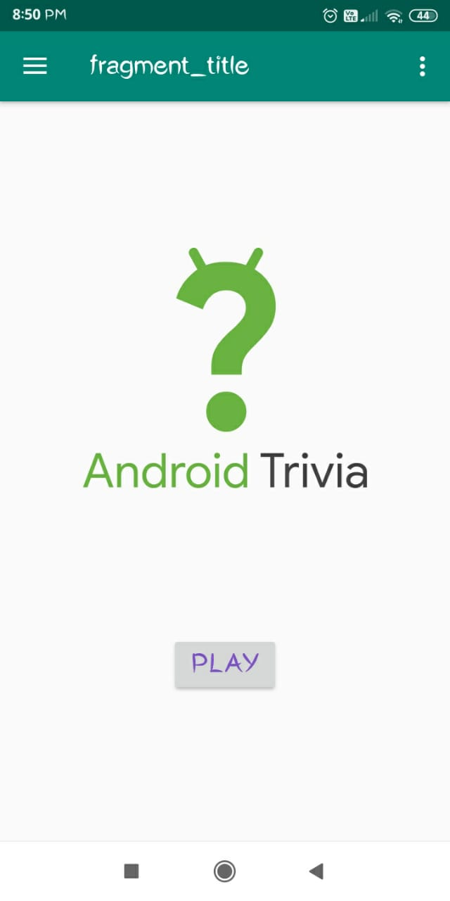
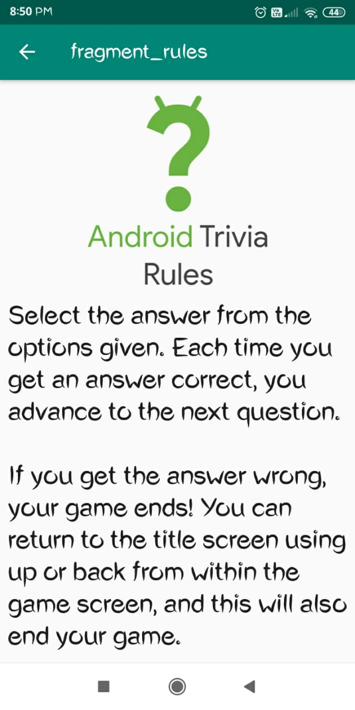
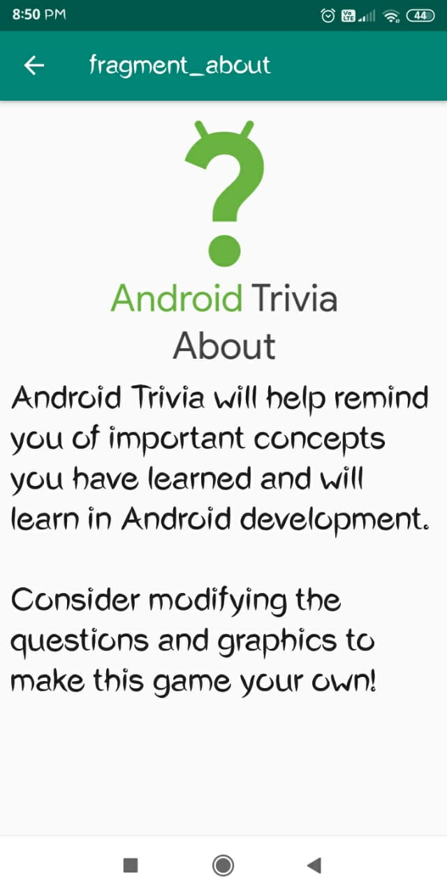
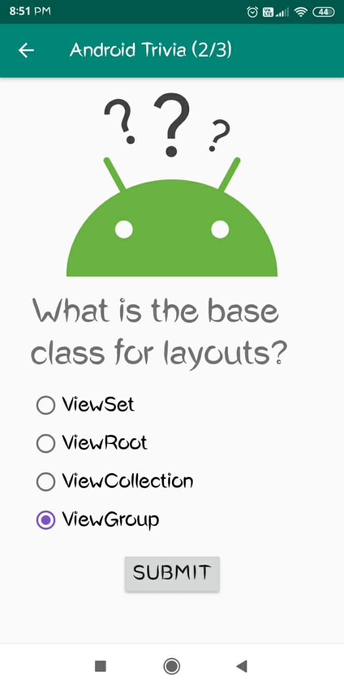
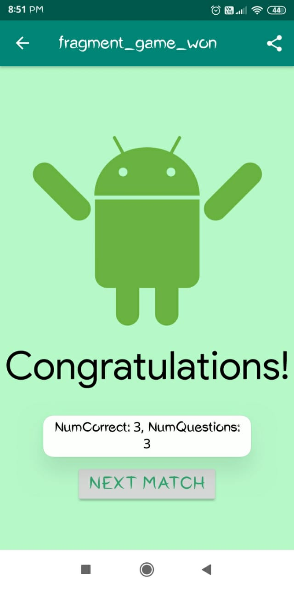
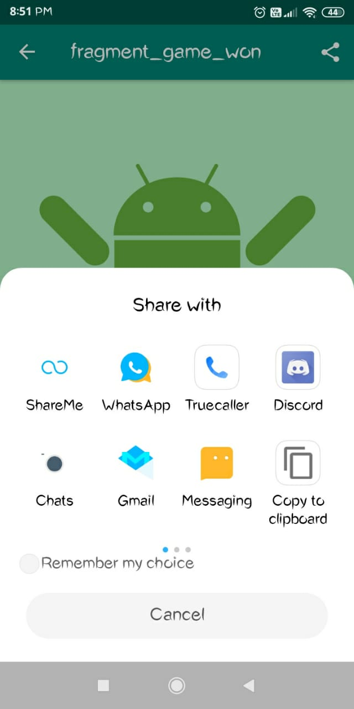
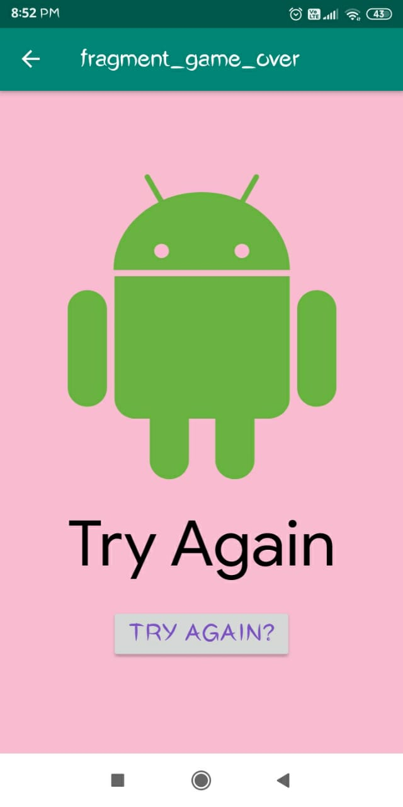

# AndroidTrivia
### Quiz App

About the App:
- Language Used - Kotlin

User can:
- Watch different sections like Rule and About before playing game
- Play a series of 3 quiz questions at a stretch to win
- Share the results to people after winning
- Replay the game after giving a wrong answer

Uses:
- Fragment
- Navigation Paths
- External Activity

# Screenshots : 

## Main Screen                                                                                ## Rules 
  &nbsp;&nbsp;&nbsp;&nbsp;&nbsp;   &nbsp;&nbsp;&nbsp;&nbsp;&nbsp;
## About                                                                                      ## Android Trivia - the game
  &nbsp;&nbsp;&nbsp;&nbsp;&nbsp;   &nbsp;&nbsp;&nbsp;&nbsp;&nbsp;
## Game Won                                                                                   ## Share
  &nbsp;&nbsp;&nbsp;&nbsp;&nbsp;   &nbsp;&nbsp;&nbsp;&nbsp;&nbsp;
## Game Lost
  &nbsp;&nbsp;&nbsp;&nbsp;&nbsp;

# How to use it?
### Clone the repo , open it in Android Studio and try it out in your Physical Device or Emulator.

# How to contribute?
### Fork the repo , make changes and give a valid Pull Request.
